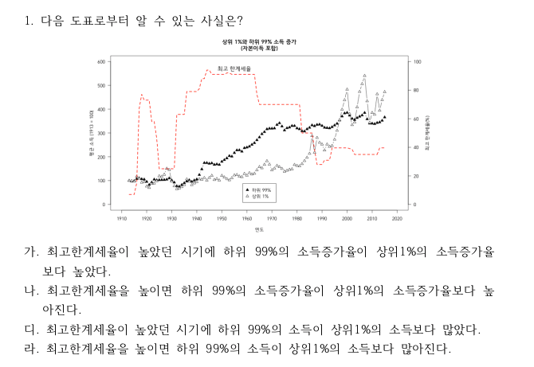
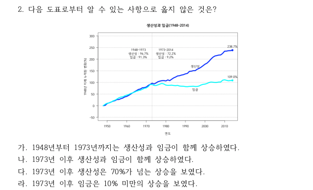
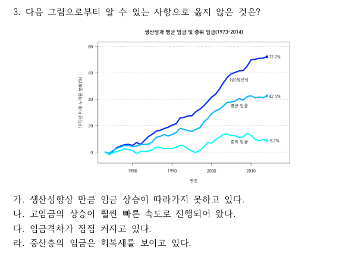
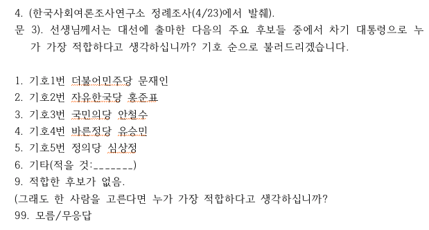
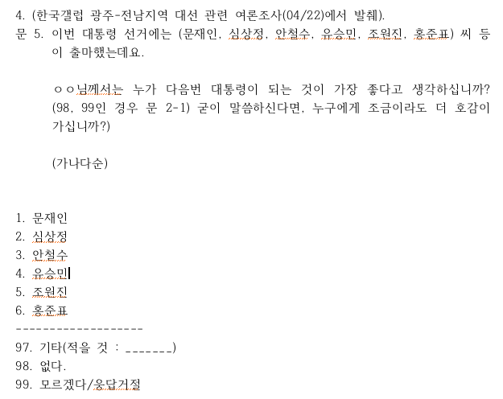

```{r setup, include=FALSE}
knitr::opts_chunk$set(echo = TRUE)
# install.packages("pander", repos = "https://cran.rstudio.com")
# install.packages("xlsx", repos = "https://cran.rstudio.com")
library(xlsx)
library(pander)
library(knitr)
panderOptions('table.split.table', Inf)
panderOptions('table.alignment.rownames', 'left')
panderOptions('table.alignment.default', 'right')
options(width = 180)
```

```{r, data, echo = FALSE, results = 'hide'}
quiz0426 <- read.xlsx("../data/quiz0426_v2.xlsx", 1, startRow = 2, endRow = 161, colIndex = c(3:7, 9:15), colClasses = c(rep("character", 12)), stringsAsFactors = FALSE)
str(quiz0426)
names(quiz0426) <- c("dept", "id", "name", "year", "e.mail", "cell.no", "Q1", "Q2", "Q3", "Q4", "group", "Q3_4")
quiz0426$dept <- factor(quiz0426$dept)
quiz0426$year <- factor(quiz0426$year)
quiz0426$group <- factor(quiz0426$group, levels = c("Red", "Black"))
quiz0426$Q3_4 <- factor(quiz0426$Q3_4, levels = c("기제출", "또제출", "제출", "미제출", "결석"))
quiz0426$Q1 <- factor(quiz0426$Q1, levels = c("가", "나", "다", "라"), labels = c("높을 때 높았다", "높이면 높아진다", "소득이 많았다", "소득이 많아진다"))
quiz0426$Q2 <- factor(quiz0426$Q2, levels = c("가", "나", "다", "라"), labels = c("황금기 함께 상승", "신자유주의시기 함께 상승", "신자유주의 시기 생산성 상승", "신자유주의 시기 임금 상승"))
quiz0426$Q3 <- factor(quiz0426$Q3, levels = c("가", "나", "다", "라"), labels = c("임금 상승 미흡", "급속한 고임금 증가율", "임금 격차 심화", "중산층 회복세"))
quiz0426$Q4.2 <- quiz0426$Q4
quiz0426$Q4.2[quiz0426$group == "Black" & quiz0426$Q4.2 == "1"] <- "문재인"
quiz0426$Q4.2[quiz0426$group == "Black" & quiz0426$Q4.2 == "2"] <- "심상정"
quiz0426$Q4.2[quiz0426$group == "Black" & quiz0426$Q4.2 == "3"] <- "안철수"
quiz0426$Q4.2[quiz0426$group == "Black" & quiz0426$Q4.2 == "4"] <- "유승민"
quiz0426$Q4.2[quiz0426$group == "Black" & quiz0426$Q4.2 == "5"] <- "조원진"
quiz0426$Q4.2[quiz0426$group == "Black" & quiz0426$Q4.2 == "6"] <- "홍준표"
quiz0426$Q4.2[quiz0426$group == "Black" & quiz0426$Q4.2 == "98"] <- "없다"
quiz0426$Q4.2[quiz0426$group == "Black" & quiz0426$Q4.2 == "99"] <- "모름/무응답"
quiz0426$Q4.2[quiz0426$group == "Red" & quiz0426$Q4.2 == "1"] <- "문재인"
quiz0426$Q4.2[quiz0426$group == "Red" & quiz0426$Q4.2 == "2"] <- "홍준표"
quiz0426$Q4.2[quiz0426$group == "Red" & quiz0426$Q4.2 == "3"] <- "안철수"
quiz0426$Q4.2[quiz0426$group == "Red" & quiz0426$Q4.2 == "4"] <- "유승민"
quiz0426$Q4.2[quiz0426$group == "Red" & quiz0426$Q4.2 == "5"] <- "심상정"
quiz0426$Q4.2[quiz0426$group == "Red" & quiz0426$Q4.2 == "9"] <- "없다"
quiz0426$Q4.2[quiz0426$group == "Red" & quiz0426$Q4.2 == "99"] <- "모름/무응답"

quiz0426$Q4.2 <- factor(quiz0426$Q4.2, levels = c("문재인", "홍준표", "안철수", "유승민", "심상정", "조원진", "없다", "모름/무응답"))
str(quiz0426)
```

```{r, randomization, echo = FALSE, results = 'hide'}
pander(summary(quiz0426))
```

### Data 재정리

#### 뒷장 응답 비교

```{r, echo = FALSE}
# quiz0426$Q3_4
Q3_4.tbl.am <- addmargins(table(quiz0426$group, quiz0426$Q3_4))
colnames(Q3_4.tbl.am)[6] <- "계"
rownames(Q3_4.tbl.am)[3] <- "계"
pander(Q3_4.tbl.am)
```

### 퀴즈 응답 비교

#### 최고한계세율과 소득집단별 소득증가



##### 황금기와 침체기

```{r, book of change, echo = FALSE}
q1.tbl <- table(quiz0426$group, quiz0426$Q1)
Q1.tbl.am <- addmargins(table(quiz0426$group, quiz0426$Q1, exclude = NULL), margin = 1)
colnames(Q1.tbl.am)[5] <- "결석"
rownames(Q1.tbl.am)[4] <- "계"
pander(Q1.tbl.am[-3, ])
pander(chisq.test(q1.tbl))
```

##### 황금기와 침체기(%)

```{r, book of change in percentage, echo = FALSE}
pander(round(prop.table(Q1.tbl.am, margin = 1)[4, ]*100, digits = 1))
```

#### 생산성과 임금



##### 황금기와 신자유주의 시기

```{r, opposite, echo = FALSE}
q2.tbl <- table(quiz0426$group, quiz0426$Q2)
Q2.tbl.am <- addmargins(table(quiz0426$group, quiz0426$Q2, exclude = NULL), margin = 1)
colnames(Q2.tbl.am)[5] <- "결석"
rownames(Q2.tbl.am)[4] <- "계"
pander(Q2.tbl.am[-3, ])
pander(chisq.test(q2.tbl))
```

##### 황금기와 신자유주의 시기 (%)

```{r, opposite in percentage, echo = FALSE}
pander(round(prop.table(Q2.tbl.am, margin = 1)[4,]*100, digits=1))
```

#### 생산성과 평균 및 중위 임금



##### 소득격차

```{r, MTR, echo = FALSE}
q3.tbl <- table(quiz0426$group, quiz0426$Q3)
Q3.tbl.am <- addmargins(table(quiz0426$group, quiz0426$Q3, exclude = NULL), margin = 1)
colnames(Q3.tbl.am)[5] <- "결석"
rownames(Q3.tbl.am)[4] <- "계"
pander(Q3.tbl.am[-3, ])
pander(chisq.test(q3.tbl))
```

##### 소득격차 (%)

```{r, MTRE in percentage, echo = FALSE}
pander(round(prop.table(Q3.tbl.am, margin = 1)[4,]*100, digits = 1))
```

### 대선 후보 지지도 질문 순서 효과

#### 기호순(Red), 가나다순(Black)




##### 후보이름을 기호순(Red)으로 불러줄 때와 가나다순(Black)으로 불러줄 때의 차이는 통계적으로 유의하지 않음.

```{r, echo = FALSE}
Q4.tbl.e <- table(quiz0426$group, quiz0426$Q4.2, exclude = NULL)
Q4.tbl.am <- addmargins(Q4.tbl.e, margin = 1)
colnames(Q4.tbl.am)[9] <- "결석"
rownames(Q4.tbl.am)[4] <- "계"
pander(Q4.tbl.am[-3, ])
```

##### % 비교.  

```{r, Soonsil in percentage, echo = FALSE}
Q4.tbl <- table(quiz0426$group, quiz0426$Q4.2)[, c(1:5, 7:8)]
pander(round(prop.table(Q4.tbl, margin = 1)*100, digits = 1))
```

#### 합산(%)

```{r, percentage in sum, echo = FALSE}
Q4.tbl.am.2 <- addmargins(Q4.tbl, margin = 1)
pander(round(prop.table(Q4.tbl.am.2[3, ])*100, digits = 1))
```

```{r, save, echo = FALSE}
#save.image("../R/quiz0426.rda")
```