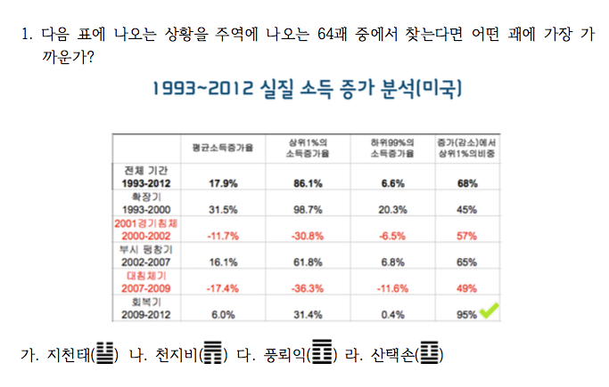
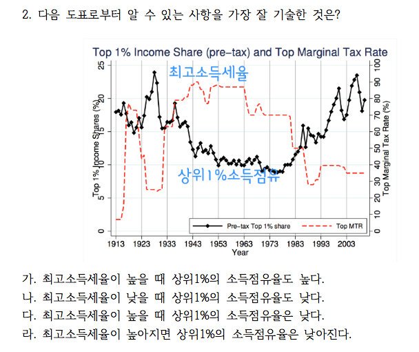
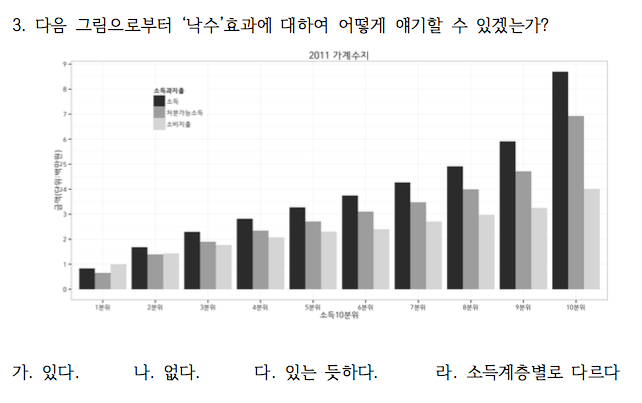
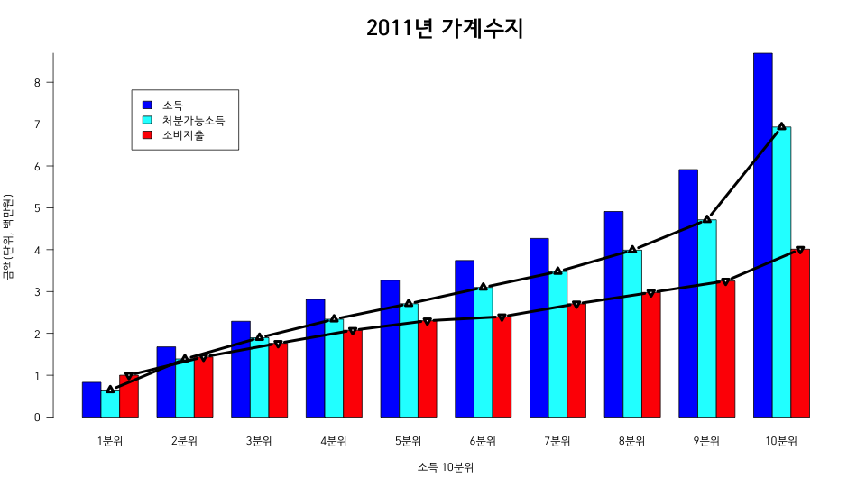

```{r setup, include=FALSE}
knitr::opts_chunk$set(echo = TRUE)
# install.packages("pander", repos = "https://cran.rstudio.com")
# install.packages("xlsx", repos = "https://cran.rstudio.com")
library(xlsx)
library(pander)
library(knitr)
panderOptions('table.split.table', Inf)
panderOptions('table.alignment.rownames', 'left')
panderOptions('table.alignment.default', 'right')
options(width = 180)
```

```{r, data, echo = FALSE, results = 'hide'}
quiz0501 <- read.xlsx("../data/quiz0501.xlsx", 1, startRow = 2, endRow = 161, colIndex = c(3:7, 9:14), colClasses = c(rep("character", 11)), stringsAsFactors = FALSE)
str(quiz0501)
names(quiz0501) <- c("dept", "id", "name", "year", "e.mail", "cell.no", "Q1", "Q2", "Q3", "Q4", "group")
quiz0501$dept <- factor(quiz0501$dept)
quiz0501$year <- factor(quiz0501$year)
quiz0501$group <- factor(quiz0501$group, levels = c("Red", "Black"))
quiz0501$Q1 <- factor(quiz0501$Q1, levels = c("가", "나", "다", "라"), labels = c("지천태", "천지비", "풍뢰익", "산택손"))
quiz0501$Q2 <- factor(quiz0501$Q2, levels = c("가", "나", "다", "라"), labels = c("높을때 높다", "낮을떄 낮다", "높을때 낮다", "높아지면 낮아진다"))
quiz0501$Q3 <- factor(quiz0501$Q3, levels = c("가", "나", "다", "라"), labels = c("있다", "없다", "있는듯하다", "계층별로 차이"))
quiz0501$Q4.2 <- quiz0501$Q4
quiz0501$Q4.2[quiz0501$group == "Black" & quiz0501$Q4.2 == "가"] <- "바꾼다"
quiz0501$Q4.2[quiz0501$group == "Black" & quiz0501$Q4.2 == "나"] <- "고수한다"
# quiz0501$Q4.2[quiz0501$group == "Black" & quiz0501$Q4.2 == "조퇴"] <- "조퇴"
quiz0501$Q4.2[quiz0501$group == "Red" & quiz0501$Q4.2 == "가"] <- "고수한다"
quiz0501$Q4.2[quiz0501$group == "Red" & quiz0501$Q4.2 == "나"] <- "바꾼다"
# quiz0501$Q4.2[quiz0501$group == "Red" & quiz0501$Q4.2 == "조퇴"] <- "조퇴"
str(quiz0501)
```

```{r, randomization, echo = FALSE, results = 'hide'}
pander(summary(quiz0501))
```

### 퀴즈 응답 비교

#### 1993 ~ 2012 미국 소득증가 집단별 비교



##### 천지비

```{r, book of change, echo = FALSE}
Q1.tbl.am <- addmargins(table(quiz0501$group, quiz0501$Q1, exclude = NULL), margin = 1)
colnames(Q1.tbl.am)[5] <- "결석"
rownames(Q1.tbl.am)[3] <- "계"
pander(Q1.tbl.am)
```

##### 천지비(%)

```{r, book of change in percentage, echo = FALSE}
pander(round(prop.table(Q1.tbl.am, margin = 1)[3, ]*100, digits = 1))
```

#### 최고세율과 상위1% 소득점유율



##### 완전히 반대로 움직임

```{r, opposite, echo = FALSE}
Q2.tbl.am <- addmargins(table(quiz0501$group, quiz0501$Q2, exclude = NULL), margin = 1)
colnames(Q2.tbl.am)[5] <- "결석"
rownames(Q2.tbl.am)[3] <- "계"
pander(Q2.tbl.am)
```

##### 완전히 반대로 움직임 (%)

```{r, opposite in percentage, echo = FALSE}
pander(round(prop.table(Q2.tbl.am, margin = 1)[3, ] * 100, digits = 1))
```

#### 소득10분위 가계 동향




##### 낙수효과?

```{r, MTR, echo = FALSE}
Q3.tbl.am <- addmargins(table(quiz0501$group, quiz0501$Q3, exclude = NULL), margin = 1)
colnames(Q3.tbl.am)[5] <- "결석"
rownames(Q3.tbl.am)[3] <- "계"
pander(Q3.tbl.am)
```

##### 낙수효과? (%)

```{r, MTRE in percentage, echo = FALSE}
pander(round(prop.table(Q3.tbl.am, margin = 1)[3, ] * 100, digits = 1))
```

### Monty Hall 문제

#### Switch or not?


##### 염소가 들어있는 문을 보여줌으로써 다른 문에 자동차가 들어 있을 확률은 2/3로 늘어나므로 바꾸는 것이 적절한 판단임. Red와 Black의 차이는 "바꾼다"와 "고수한다"의 순서를 바꾼 것으로 별 차이를 보이지 않아 합산하였다.  

```{r, Monty Hall, echo = FALSE}
Q4.tbl.e <- table(quiz0501$group, quiz0501$Q4.2, exclude = NULL)
Q4.tbl.am <- addmargins(Q4.tbl.e, margin = 1)
colnames(Q4.tbl.am)[3] <- "결석"
rownames(Q4.tbl.am)[3] <- "계"
pander(Q4.tbl.am)
```

##### % 비교.  

```{r, Monty Hall in percentage, echo = FALSE}
Q4.tbl <- table(quiz0501$group, quiz0501$Q4.2)[, 1:2]
pander(round(prop.table(Q4.tbl, margin = 1)*100, digits = 1))
```

#### 합산(%)

```{r, percentage in sum, echo = FALSE}
Q4.tbl.am.2 <- addmargins(Q4.tbl, margin = 1)
pander(round(prop.table(Q4.tbl.am.2[3, ])*100, digits = 1))
```

```{r, save, echo = FALSE}
#save.image("../R/quiz0501.RData")
```