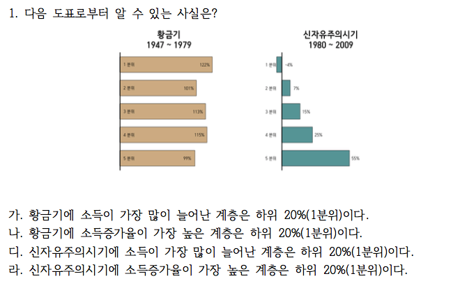
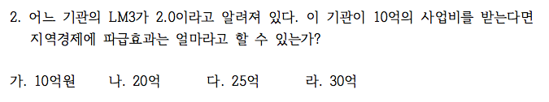
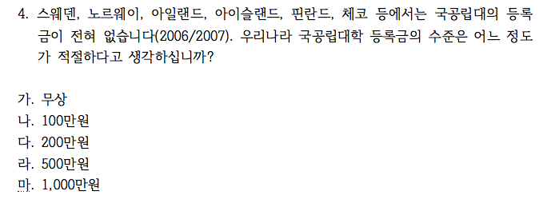
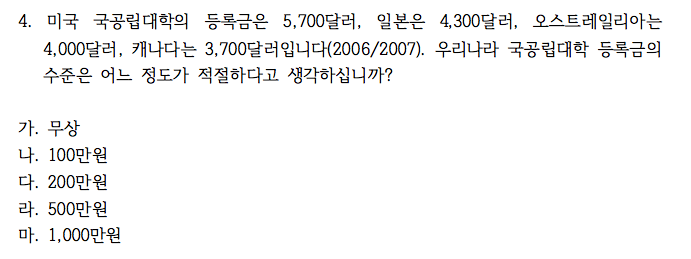

```{r setup, include=FALSE}
knitr::opts_chunk$set(echo = TRUE)
# install.packages("pander", repos = "https://cran.rstudio.com")
# install.packages("xlsx", repos = "https://cran.rstudio.com")
library(xlsx)
library(pander)
library(knitr)
panderOptions('table.split.table', Inf)
panderOptions('table.alignment.rownames', 'left')
panderOptions('table.alignment.default', 'right')
# options(width = 180)
```

```{r, data, echo = FALSE, results = 'hide'}
quiz0503 <- read.xlsx("../data/quiz0503.xlsx", 1, startRow = 2, endRow = 161, colIndex = c(3:7, 9:14), colClasses = c(rep("character", 11)), stringsAsFactors = FALSE)
str(quiz0503)
names(quiz0503) <- c("dept", "id", "name", "year", "e.mail", "cell.no", "Q1", "Q2", "Q3", "Q4", "group")
quiz0503$dept <- factor(quiz0503$dept)
quiz0503$year <- factor(quiz0503$year)
quiz0503$group <- factor(quiz0503$group, levels = c("Red", "Black"))
quiz0503$Q1 <- factor(quiz0503$Q1, 
                      levels = c("가", "나", "다", "라"), 
                      labels = c("황금기 최대증가 1분위", 
                                 "황금기 최대증가율 1분위", 
                                 "신자유주의기 최대증가 1분위", 
                                 "신자유주의기 최대증가율 1분위"))
quiz0503$Q2 <- factor(quiz0503$Q2, levels = c("가", "나", "다", "라"), labels = c("10억", "20억", "25억", "30억"))
quiz0503$Q3 <- factor(quiz0503$Q3, levels = c("가", "나", "다", "라"), labels = c("100%", "75%", "50%", "25%"))
quiz0503$Q4 <- factor(quiz0503$Q4, levels = c("가", "나", "다", "라", "마"), labels = c("무상", "100만원", "200만원", "500만원", "1,000만원"))
str(quiz0503)
```

```{r, randomization, echo = FALSE, results = 'hide'}
pander(summary(quiz0503))
```

### 퀴즈 응답 비교

#### 생산성과 평균 및 중위 임금



##### 평균 임금과 중위 임금

```{r, productivity vs wage, echo = FALSE}
Q1.tbl.am <- addmargins(table(quiz0503$group, quiz0503$Q1, exclude = NULL), margin = 1)
colnames(Q1.tbl.am)[5] <- "결석"
rownames(Q1.tbl.am)[3] <- "계"
pander(Q1.tbl.am)
```

##### 평균임금과 중위 임금 (%)

```{r, productivity vs wage in percentage, echo = FALSE}
pander(round(prop.table(Q1.tbl.am, margin = 1)[3, ]*100, digits = 1))
```

#### LM3



##### LM3의 의미

```{r, LM3, echo = FALSE}
tbl.q2 <- table(quiz0503$group, quiz0503$Q2, useNA = "always")
Q2.tbl.am <- addmargins(tbl.q2, margin = 1)
colnames(Q2.tbl.am)[5] <- "결석"
rownames(Q2.tbl.am)[3] <- "계"
pander(Q2.tbl.am)
pander(chisq.test(tbl.q2[-3, ]))
```

##### 

```{r, LM3 in percentage, echo = FALSE}
pander(round(prop.table(Q2.tbl.am, margin = 1)[3, ] * 100, digits = 1))
```

#### 식량자급률


##### 우리나라 식량자급률 수준

```{r, MTR, echo = FALSE}
Q3.tbl.am <- addmargins(table(quiz0503$group, quiz0503$Q3, exclude = NULL), margin = 1)
colnames(Q3.tbl.am)[5] <- "결석"
rownames(Q3.tbl.am)[3] <- "계"
pander(Q3.tbl.am)
```

##### 우리나라 식량자급률 수준 (%)

```{r, MTRE in percentage, echo = FALSE}
pander(round(prop.table(Q3.tbl.am, margin = 1)[3, ] * 100, digits = 1))
```

#### 국공립대 등록금 국제 비교




이 질문은 THAAD배치 질문에서와 같이 배경 설명이 응답에 많은 영향을 미친다는 것을 보여줍니다. 국공립대학의 등록금이 무상인 나라들을 소개한 Red군에서는 적정 수준이 "무상" 또는 100만원 이라고 이라고 응답한 비율이 61.6%로 국공립대학의 등록금이 우리나라보다 높거나 대등한 나라들의 예를 먼저 들고 적정 수준을 물어본 경우(Black)에 "무상" 또는 100만원이라고 응답한 비율인 42.8%보다 월등히 높은 것을 알 수 있습니다. 500만원 이상을 적정하다고 응답한 비율이 Red 집단에는 2.7%밖에 없지만 Black 집단에는 18.6%나 되는 점도 마찬가지 이유에서 입니다.

##### 국공립대 등록금의 적정 수준

```{r, college tuition, echo = FALSE}
Q4.tbl.am <- addmargins(table(quiz0503$group, quiz0503$Q4, exclude = NULL), margin = 1)
colnames(Q4.tbl.am)[6] <- "결석"
rownames(Q4.tbl.am)[3] <- "계"
pander(Q4.tbl.am)
```

##### 국공립대 등록금의 적정 수준 (%)

```{r, college tuition in percentage, echo = FALSE}
pander(round(prop.table(Q4.tbl.am[, -6], margin = 1)[-(3:4), ]*100, digits = 1))
```

```{r, save, echo = FALSE}
# save.image("../R/quiz0503.rda")
```