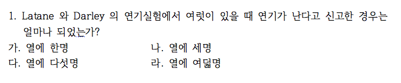
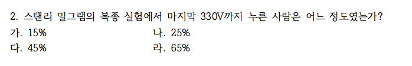
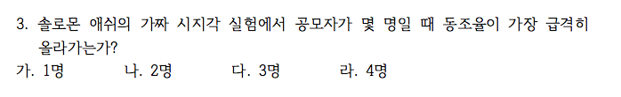

```{r setup, include=FALSE}
knitr::opts_chunk$set(echo = TRUE)
# install.packages("pander", repos = "https://cran.rstudio.com")
# install.packages("xlsx", repos = "https://cran.rstudio.com")
library(xlsx)
library(pander)
library(knitr)
panderOptions('table.split.table', Inf)
panderOptions('table.alignment.rownames', 'left')
panderOptions('table.alignment.default', 'right')
options(width = 180)
```

```{r, data, echo = FALSE, results = 'hide'}
quiz0508 <- read.xlsx("../data/quiz0508.xlsx", 1, startRow = 2, endRow = 161, colIndex = c(3:7, 9:14), colClasses = c(rep("character", 11)), stringsAsFactors = FALSE)
str(quiz0508)
names(quiz0508) <- c("dept", "id", "name", "year", "e.mail", "cell.no", "Q1", "Q2", "Q3", "Q4", "group")
quiz0508$dept <- factor(quiz0508$dept)
quiz0508$year <- factor(quiz0508$year)
quiz0508$group <- factor(quiz0508$group, levels = c("Red", "Black"))
quiz0508$Q1 <- factor(quiz0508$Q1, levels = c("가", "나", "다", "라"), labels = c("열에 한명", "열에 세명", "열에 다섯명", "열에 여덟명"))
quiz0508$Q2 <- factor(quiz0508$Q2, levels = c("가", "나", "다", "라"), labels = c("15%", "25%", "45%", "65%"))
quiz0508$Q3 <- factor(quiz0508$Q3, levels = c("가", "나", "다", "라"), labels = c("1명", "2명", "3명", "4명"))
# quiz0508$Q4.2 <- quiz0508$Q4
Black <- quiz0508$group == "Black"
Red <- quiz0508$group == "Red"
quiz0508$Q4.2[Red] <- ifelse(quiz0508$Q4[Red] == "가", "확실히", ifelse(quiz0508$Q4[Red] == "나", "확률적으로", NA))
quiz0508$Q4.2[Black] <- ifelse(quiz0508$Q4[Black] == "가", "확실히", ifelse(quiz0508$Q4[Black] == "나", "확률적으로", NA))
quiz0508$Q4.2 <- factor(quiz0508$Q4.2, levels = c("확실히", "확률적으로"))
str(quiz0508)
```

```{r, randomization, echo = FALSE, results = 'hide'}
pander(summary(quiz0508))
```

### 퀴즈 응답 비교

#### Latane and Darley



##### 방관자 효과

```{r, bystander, echo = FALSE}
tbl.q1 <- table(quiz0508$group, quiz0508$Q1, useNA = "always")
Q1.tbl.am <- addmargins(tbl.q1, margin = 1)
colnames(Q1.tbl.am)[5] <- "결석"
rownames(Q1.tbl.am)[4] <- "계"
pander(Q1.tbl.am[-3, ])
pander(chisq.test(tbl.q1[-3, ], simulate.p.value = TRUE))
```

##### 방관자 효과(%)

```{r, bystander in percentage, echo = FALSE}
pander(round(prop.table(Q1.tbl.am, margin = 1)[4, ]*100, digits = 1))
```

#### Stanley Milgram



##### 450V까지 누르는 사람

```{r, obedience, echo = FALSE}
tbl.q2 <- table(quiz0508$group, quiz0508$Q2, useNA = "always")
Q2.tbl.am <- addmargins(tbl.q2, margin = 1)
colnames(Q2.tbl.am)[5] <- "결석"
rownames(Q2.tbl.am)[4] <- "계"
pander(Q2.tbl.am[-3, ])
pander(chisq.test(tbl.q2[-3, ]))
```

##### 450V까지 누르는 사람 (%)

```{r, obedience in percentage, echo = FALSE}
pander(round(prop.table(Q2.tbl.am, margin = 1)[4,]*100, digits=1))
```

#### Solomon Asch



##### Power of 3

```{r, Power of 3, echo = FALSE}
tbl.q3 <- table(quiz0508$group, quiz0508$Q3, useNA = "always")
Q3.tbl.am <- addmargins(tbl.q3, margin = 1)
colnames(Q3.tbl.am)[5] <- "결석"
rownames(Q3.tbl.am)[4] <- "계"
pander(Q3.tbl.am[-3, ])
pander(chisq.test(tbl.q3[-3, ], simulate.p.value = TRUE))
```

##### Power of 3 (%)

```{r, Power of 3 in percentage, echo = FALSE}
pander(round(prop.table(Q3.tbl.am, margin = 1)[4,]*100, digits = 1))
```

### Framing Effect

#### 삶과 죽음


##### 600명 중 200명이 사는 거나 400명이 죽는 것, 모두 살리는 거나 모두 죽지 않는 것이나 같은 내용임에도 반응이 다르게 나타남에 유의. 손실회피 경향과 같은 현상을 관찰할 수 있음.

```{r, Framing Effect, echo = FALSE}
tbl <- table(quiz0508$group, quiz0508$Q4.2, exclude = NULL)
rownames(tbl) <- c("생존 프레임", "사망 프레임")
colnames(tbl)[3] <- "결석"
kable(tbl[1:2, ], caption = "Framing Effect")
pander(chisq.test(tbl[1:2, 1:2], simulate.p.value = TRUE))
```

##### % 비교.  

```{r, Framing effects in percentage, echo = FALSE}
tbl.p.a <- addmargins(round(prop.table(tbl[1:2, -3], margin = 1)*100, digits = 1))[1:2, ]
colnames(tbl.p.a)[3] <- "계"
kable(tbl.p.a)
```

```{r, save, echo = FALSE}
#save.image("../R/quiz0508.RData")
```