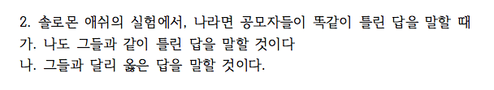
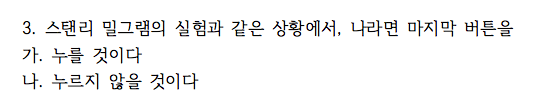

```{r setup, include=FALSE}
knitr::opts_chunk$set(echo = TRUE)
# install.packages("pander", repos = "https://cran.rstudio.com")
# install.packages("xlsx", repos = "https://cran.rstudio.com")
# library(xlsx)
library(openxlsx)
library(pander)
library(knitr)
panderOptions('table.split.table', Inf)
panderOptions('table.alignment.rownames', 'left')
panderOptions('table.alignment.default', 'right')
options(width = 180)
```

```{r, data, echo = FALSE, results = 'hide'}
quiz0508 <- read.xlsx("../data/quiz0508_hn.xlsx", startRow = 2, rows = 2:161, cols = c(3:7, 9:14))
# quiz0508 <- read.xlsx("../data/quiz0508_hn.xlsx", 1, startRow = 2, endRow = 161, colIndex = c(3:7, 9:14), colClasses = c(rep("character", 11)), stringsAsFactors = FALSE)
str(quiz0508)
names(quiz0508) <- c("dept", "id", "name", "year", "e.mail", "cell.no", "Q1", "Q2", "Q3", "Q4", "group")
quiz0508$dept <- factor(quiz0508$dept)
quiz0508$year <- factor(quiz0508$year)
quiz0508$group <- factor(quiz0508$group, levels = c("Red", "Black"))
quiz0508$Q1 <- factor(quiz0508$Q1, levels = c("가", "나"), labels = c("천사", "악마"))
quiz0508$Q2 <- factor(quiz0508$Q2, levels = c("가", "나"), labels = c("동조", "거부"))
quiz0508$Q3 <- factor(quiz0508$Q3, levels = c("가", "나"), labels = c("누를 것이다", "누르지 않는다"))
quiz0508$Q4 <- factor(quiz0508$Q4, levels = c("가", "나"), labels = c("그들과 같이", "그들과 달리"))
str(quiz0508)
```

```{r, randomization, echo = FALSE, results = 'hide'}
pander(summary(quiz0508))
```

### 퀴즈 응답 비교

#### Circle Limit IV


##### 천사와 악마

```{r, bystander, echo = FALSE}
tbl.q1 <- table(quiz0508$group, quiz0508$Q1, useNA = "always")
Q1.tbl.am <- addmargins(tbl.q1, margin = 1)
colnames(Q1.tbl.am)[3] <- "결석"
rownames(Q1.tbl.am)[4] <- "계"
pander(Q1.tbl.am[-3, ])
# pander(chisq.test(tbl.q1[-3, ]))
```

##### 천사와 악마(%)

```{r, bystander in percentage, echo = FALSE}
tbl.q1.2 <- table(quiz0508$Q1)
pander(round(prop.table(tbl.q1.2) * 100, digits = 1))
```

#### Solomon Asch



##### 집단 사고

```{r, obedience, echo = FALSE}
tbl.q2 <- table(quiz0508$group, quiz0508$Q2, useNA = "always")
Q2.tbl.am <- addmargins(tbl.q2, margin = 1)
colnames(Q2.tbl.am)[3] <- "결석"
rownames(Q2.tbl.am)[4] <- "계"
pander(Q2.tbl.am[-3, ])
# pander(chisq.test(tbl.q2[-3, ]))
```

##### 집단 사고 (%)

```{r, obedience in percentage, echo = FALSE}
tbl.q2.2 <- table(quiz0508$Q2)
pander(round(prop.table(tbl.q2.2) * 100, digits = 1))
```

#### Stanley Milgram



##### 복종

```{r, Power of 3, echo = FALSE}
tbl.q3 <- table(quiz0508$group, quiz0508$Q3, useNA = "always")
Q3.tbl.am <- addmargins(tbl.q3, margin = 1)
colnames(Q3.tbl.am)[3] <- "결석"
rownames(Q3.tbl.am)[4] <- "계"
pander(Q3.tbl.am[-3, ])
# pander(chisq.test(tbl.q3[-3, ]))
```

##### 복종 (%)

```{r, Power of 3 in percentage, echo = FALSE}
tbl.q3.2 <- table(quiz0508$Q3)
pander(round(prop.table(tbl.q3.2) * 100, digits = 1))
```

#### Philip Zimbardo

#### 스탠포드 모의교도소 실험


```{r, Framing Effect, echo = FALSE}
tbl.q4 <- table(quiz0508$group, quiz0508$Q4, useNA = "always")
Q4.tbl.am <- addmargins(tbl.q4, margin = 1)
colnames(Q4.tbl.am)[3] <- "결석"
rownames(Q4.tbl.am)[4] <- "계"
pander(Q4.tbl.am[-3, ])
# pander(chisq.test(tbl.q4[-3, ]))
```

##### 스탠포드 모의교도소 실험(%).  

```{r, Framing effects in percentage, echo = FALSE}
tbl.q4.2 <- table(quiz0508$Q4)
pander(round(prop.table(tbl.q4.2) * 100, digits = 1))
```

```{r, save, echo = FALSE}
#save.image("../R/quiz0508.RData")
```