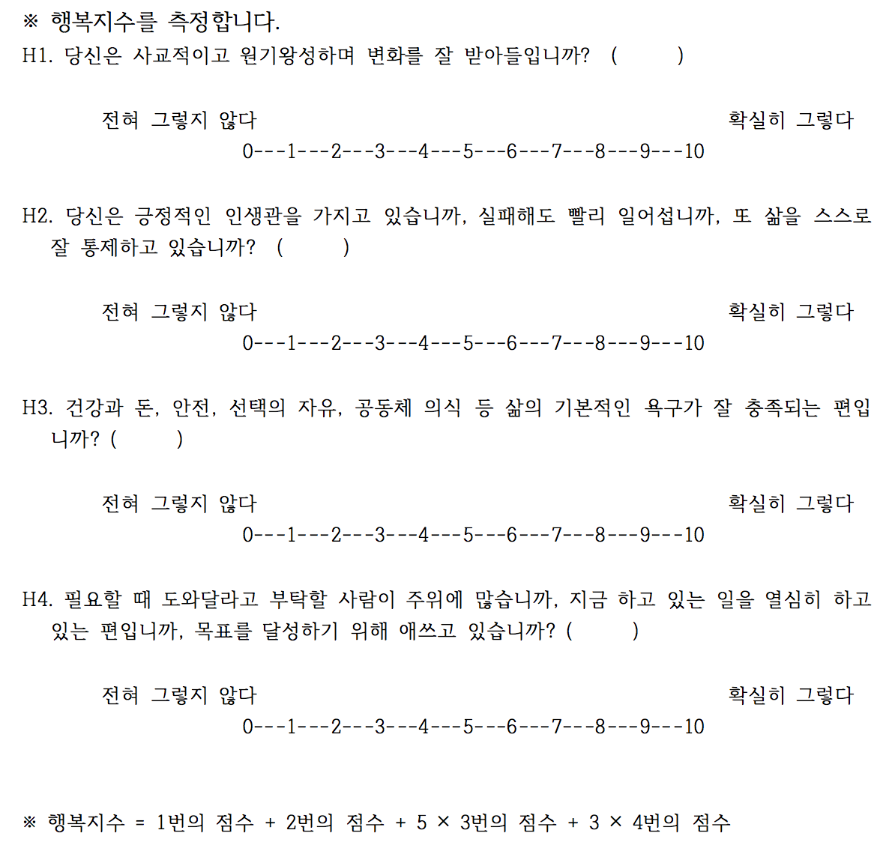

```{r setup, include=FALSE}
knitr::opts_chunk$set(echo = TRUE)
library(openxlsx)
library(pander)
library(knitr)
panderOptions('table.split.table', Inf)
panderOptions('table.alignment.rownames', 'left')
panderOptions('table.alignment.default', 'right')
options(width = 180)
```

### Data 

```{r, data, echo = FALSE, results = 'hide'}
quiz0515 <- read.xlsx("../data/quiz170515.xlsx", sheet = 1, startRow = 2, rows = 2:161, cols = c(3:7, 9:15))
str(quiz0515)
names(quiz0515) <- c("dept", "id", "name", "year", "e.mail", "cell.no", paste("Q", 1:5, sep = ""), "group")
quiz0515$dept <- factor(quiz0515$dept)
quiz0515$year <- factor(quiz0515$year)
quiz0515$group <- factor(quiz0515$group, levels = c("Red", "Black"))
quiz0515$score <- quiz0515$Q1 + quiz0515$Q2 + 5*quiz0515$Q3 + 3*quiz0515$Q4
quiz0515$grade <- cut(quiz0515$score, breaks = seq(0, 100, by = 10), include.lowest = TRUE, right = FALSE)
Black <- quiz0515$group == "Black"
Red <- quiz0515$group == "Red"
quiz0515$Q5.2[Red] <- ifelse(quiz0515$Q5[Red] == "가", "티켓 분실", ifelse(quiz0515$Q5[Red] == "나", "티켓 분실", NA))
quiz0515$Q5.2[Black] <- ifelse(quiz0515$Q5[Black] == "가", "현금 분실", ifelse(quiz0515$Q5[Black] == "나", "현금 분실", NA))
quiz0515$Q5.3[Red] <- ifelse(quiz0515$Q5[Red] == "가", "산다", ifelse(quiz0515$Q5[Red] == "나", "안 산다", NA))
quiz0515$Q5.3[Black] <- ifelse(quiz0515$Q5[Black] == "가", "산다", ifelse(quiz0515$Q5[Black] == "나", "안 산다", NA))
# str(quiz0515)
```

### Happiness Index



#### Descriptive Statistics

```{r, grades, echo = FALSE}
# pander(quiz0515[c("id", "name", "score", "grade")])
pander(quiz0515[c("id", "score", "grade")])
```

#### Cross Tables

```{r, cross table, echo = FALSE}
happy.tbl <- table(quiz0515$group, quiz0515$grade, exclude = NULL)
happy.tbl.a <- addmargins(happy.tbl)
colnames(happy.tbl.a)[11:12] <- c("결석", "계")
rownames(happy.tbl.a)[3] <- "계"
pander(happy.tbl.a)
```

#### Summary Statistics

```{r, summary, echo = FALSE}
pander(tapply(quiz0515$score, quiz0515$group, summary))
```

#### Standard Deviation

```{r, SD, echo = FALSE}
pander(tapply(quiz0515$score, quiz0515$group, sd, na.rm = TRUE), caption = "Standard Deviation")
```

#### t test (Welch's)

```{r, t test, echo = FALSE}
pander(t.test(score ~ group, data = quiz0515))
```

### Plots

#### Box plot

```{r, Box plot, echo = FALSE, fig.width = 7, fig.height = 7}
plot(score~group, data = quiz0515)
```

#### QQplot

```{r, qqplot, echo = FALSE, fig.width =7, fig.height = 7}
qqplot(quiz0515$score[Black], quiz0515$score[Black], xlab = "Black", ylab = "Red")
```

#### Summary 

```{r, stats}
pander(summary(quiz0515$score))
```

### 심적회계(Mental Account)

돈 주고 산 티켓을 잃어버리는 것과 티켓을 살 돈을 잃어버리고 카드로 살 수 있는 것의 심리적 차이에 대한 질문.

#### 심적회계


##### 티켓과 현금

10만원 짜리 입장권을 잃어버리는 것과 티켓 살 돈 10만원을 잃어버리는 것이 동일한 금액임에도 돈을 잃어버리고 카드로 구매할 경우에는 사겠다는 비율이 높아지는 점에 유의.

```{r, Mental Account, echo = FALSE}
tbl.q5 <- table(quiz0515$Q5.2, quiz0515$Q5.3)
rownames(tbl.q5) <- c("티켓분실", "현금분실")
tbl.q5.a <- addmargins(tbl.q5)
rownames(tbl.q5.a)[3] <- "계"
colnames(tbl.q5.a)[3] <- "계"
kable(tbl.q5.a, caption = "심적 회계")
```

##### % 비교.  

```{r, Mental account  in percentage, echo = FALSE}
tbl.q5.p.a <- addmargins(round(prop.table(tbl.q5[1:2, ], margin = 1)*100, digits = 1))[1:2, ]
colnames(tbl.q5.p.a)[3] <- "계"
kable(tbl.q5.p.a)
```

<!--
### Save and Exit

```{r, save, echo = FALSE}
save.image("../R/quiz170515.RData")
```
-->
